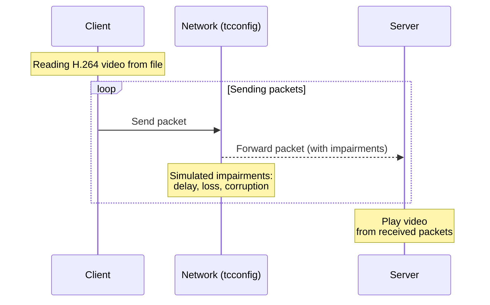

> Documentation available in other languages::
> - [Russian](README.ru.md)

## h264 Testbed

This project is a test client-server application for experimenting with encoding/decoding using RS codes under near-real conditions.

The testing model simulates network impairments between the client and server:



In the diagram and during testing, impairments were simulated using the [tcconfig](https://github.com/thombashi/tcconfig) utility

### Build

#### Dependencies

* A compiler with `C++23` support
* `FFmpeg` (`libavformat`, `libavcodec`, `libavutil`, `libswscale`)
* `SDL2` (`libsdl1.2`)
* `Intel TBB`
* `rapidjson`
* `pkg-config`

> <details> <summary> 
> Install dependencies (Ubuntu/Debian)
> </summary>
>
> ```shell
> sudo apt install build-essential cmake pkg-config \
> libavformat-dev libavcodec-dev libavutil-dev libswscale-dev \
> libsdl2-dev libtbb-dev
> ```
> </details> 

> <details> <summary> 
> Update GCC (Ubuntu/Debian)
> </summary>
>
> ```shell
> sudo apt install gcc-13 g++-13
> ```
>
> Then:
>
> ```shell
> sudo update-alternatives --install /usr/bin/gcc gcc /usr/bin/gcc-13 130
> sudo update-alternatives --install /usr/bin/g++ g++ /usr/bin/g++-13 130
> ```
> </details>

#### CMake

The project uses `cmake` for building. To obtain the server and client executables, simply run:

```shell
git clone --recursive https://github.com/zachbabanov/h264.git
cd h264
mkdir build && cd build
cmake .. -DCMAKE_BUILD_TYPE=Release
cmake --build . -j$(nproc)
```

### Configuration

Before running, make sure that the directories `config/` and `log/`, exist next to the executable, and that the `/config`
directory contains populated configuration files (`client.json`/`server.json`)

The format and fields of the configuration files are described in the `json-scheme`: [client.json](./json-schema/client.json) and [server.json](json-schema/server.json)

### Data Transfer Protocol

When streaming an H.264 video stream, `NAL Unit` are split into blocks of 1024 bytes. Packets are then formed with the
following header encapsulated in `UDP`:

```asciidoc
  0                   1                   2                   3                   4
 0 1 2 3 4 5 6 7 8 9 0 1 2 3 4 5 6 7 8 9 0 1 2 3 4 5 6 7 8 9 0 1 2 3 4 5 6 7 8 9 0
+-+-+-+-+-+-+-+-+-+-+-+-+-+-+-+-+-+-+-+-+-+-+-+-+-+-+-+-+-+-+-+-+-+-+-+-+-+-+-+-+-+
|     ENCODE MODE     |   PACKET INDEX    |              PAYLOAD SIZE             |
+-+-+-+-+-+-+-+-+-+-+-+-+-+-+-+-+-+-+-+-+-+-+-+-+-+-+-+-+-+-+-+-+-+-+-+-+-+-+-+-+-+
|                                   BLOCK INDEX                                   |
+-+-+-+-+-+-+-+-+-+-+-+-+-+-+-+-+-+-+-+-+-+-+-+-+-+-+-+-+-+-+-+-+-+-+-+-+-+-+-+-+-+
|                                NALU BLOCK INDEX                                 |
+-+-+-+-+-+-+-+-+-+-+-+-+-+-+-+-+-+-+-+-+-+-+-+-+-+-+-+-+-+-+-+-+-+-+-+-+-+-+-+-+-+
|                                 NALU BLOCK SIZE                                 |
+-+-+-+-+-+-+-+-+-+-+-+-+-+-+-+-+-+-+-+-+-+-+-+-+-+-+-+-+-+-+-+-+-+-+-+-+-+-+-+-+-+
|                                     PAYLOAD                                     |
+-+-+-+-+-+-+-+-+-+-+-+-+-+-+-+-+-+-+-+-+-+-+-+-+-+-+-+-+-+-+-+-+-+-+-+-+-+-+-+-+-+
```

For a packet without RS encoding, `PAYLOAD` is the full 1024-byte block. When encoding is used, it is a decimated segment
of 128 bytes (every n-th byte of the encoded sequences obtained after encoding the 1024-byte block).