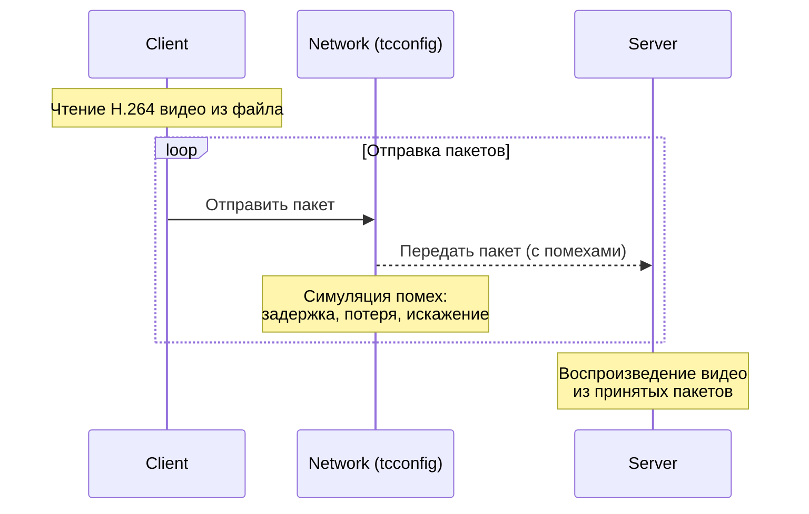

> Документация доступна на других языках:
> - [English](README.md)

## Тестовый стенд h264

Данный проект представляет собой тестовое клиент-серверное приложение для проведения экспериментов с
кодированием/декодированием с помомщью РСЭ-кодов в условиях близким к реальным

Модель тестирования предполагает симуляцию помех между клиентом и сервером:



На схеме и при тестировании помехи симулировались с помощью утилиты [tcconfig](https://github.com/thombashi/tcconfig)

### Сборка

#### Зависимости

* Компилятор с поддержкой `C++23`
* `FFmpeg` (`libavformat`, `libavcodec`, `libavutil`, `libswscale`)
* `SDL2` (`libsdl1.2`)
* `Intel TBB`
* `rapidjson`
* `pkg-config`

> <details> <summary> 
> Установка зависимостей (Ubuntu/Debian)
> </summary>
> 
> ```shell
> sudo apt install build-essential cmake pkg-config \
> libavformat-dev libavcodec-dev libavutil-dev libswscale-dev \
> libsdl2-dev libtbb-dev
> ```
> </details> 

> <details> <summary> 
> Обновление GCC (Ubuntu/Debian)
> </summary>
>
> ```shell
> sudo apt install gcc-13 g++-13
> ```
> 
> А затем:
> 
> ```shell
> sudo update-alternatives --install /usr/bin/gcc gcc /usr/bin/gcc-13 130
> sudo update-alternatives --install /usr/bin/g++ g++ /usr/bin/g++-13 130
> ```
> </details>

#### CMake

Для сборки в проекте используется `cmake`, потому для получения исполняемых файлов сервера и клиента достаточно:

```shell
git clone --recursive https://github.com/zachbabanov/h264.git
cd h264
mkdir build && cd build
cmake .. -DCMAKE_BUILD_TYPE=Release
cmake --build . -j$(nproc)
```

### Конфигурирование

Перед запуском убедитесь, что рядом с исполняемым файлом созданы директории `config/` и `log/`, а так же в наличии
в директории `/config` заполненного конфигурационного файла (`client.json`/`server.json`)

Формат и поля конфигурационных файлов описаны в `json-scheme`: [client.json](./json-schema/client.json) и [server.json](json-schema/server.json)

### Протокол передачи данных

При стриминге h.264 видео-потока, `NAL Unit` разбиваются на блоки по 1024 байта, после чего формируются пакеты, со
следующим заголовком инкапсулированным в `UDP`:  

```asciidoc
  0                   1                   2                   3                   4
 0 1 2 3 4 5 6 7 8 9 0 1 2 3 4 5 6 7 8 9 0 1 2 3 4 5 6 7 8 9 0 1 2 3 4 5 6 7 8 9 0
+-+-+-+-+-+-+-+-+-+-+-+-+-+-+-+-+-+-+-+-+-+-+-+-+-+-+-+-+-+-+-+-+-+-+-+-+-+-+-+-+-+
|     ENCODE MODE     |   PACKET INDEX    |              PAYLOAD SIZE             |
+-+-+-+-+-+-+-+-+-+-+-+-+-+-+-+-+-+-+-+-+-+-+-+-+-+-+-+-+-+-+-+-+-+-+-+-+-+-+-+-+-+
|                                   BLOCK INDEX                                   |
+-+-+-+-+-+-+-+-+-+-+-+-+-+-+-+-+-+-+-+-+-+-+-+-+-+-+-+-+-+-+-+-+-+-+-+-+-+-+-+-+-+
|                                NALU BLOCK INDEX                                 |
+-+-+-+-+-+-+-+-+-+-+-+-+-+-+-+-+-+-+-+-+-+-+-+-+-+-+-+-+-+-+-+-+-+-+-+-+-+-+-+-+-+
|                                 NALU BLOCK SIZE                                 |
+-+-+-+-+-+-+-+-+-+-+-+-+-+-+-+-+-+-+-+-+-+-+-+-+-+-+-+-+-+-+-+-+-+-+-+-+-+-+-+-+-+
|                                     PAYLOAD                                     |
+-+-+-+-+-+-+-+-+-+-+-+-+-+-+-+-+-+-+-+-+-+-+-+-+-+-+-+-+-+-+-+-+-+-+-+-+-+-+-+-+-+
```

В случае пакета без РСЭ кодирования `PAYLOAD` - полный блок в 1024 байта, при кодировании же - децимированный участок в
128 байт (Все n байты закодирвоанных последовательностей полученных после кодирования 1024 байтного блока)